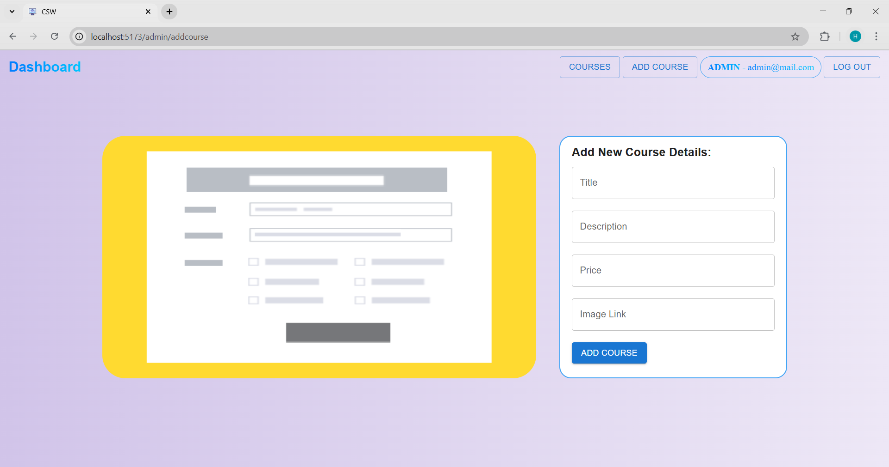
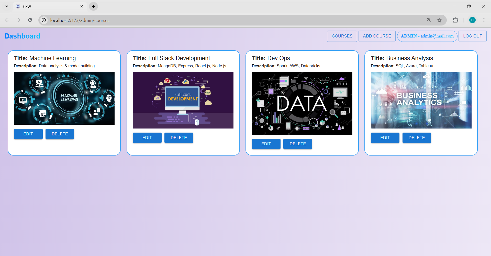
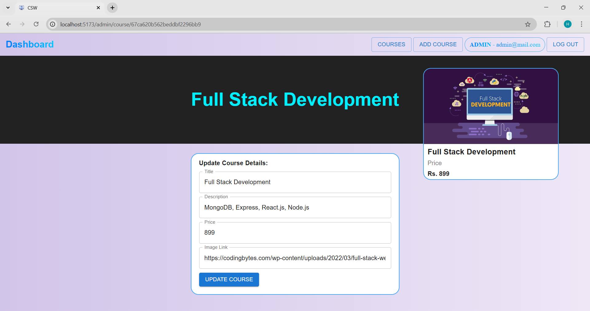
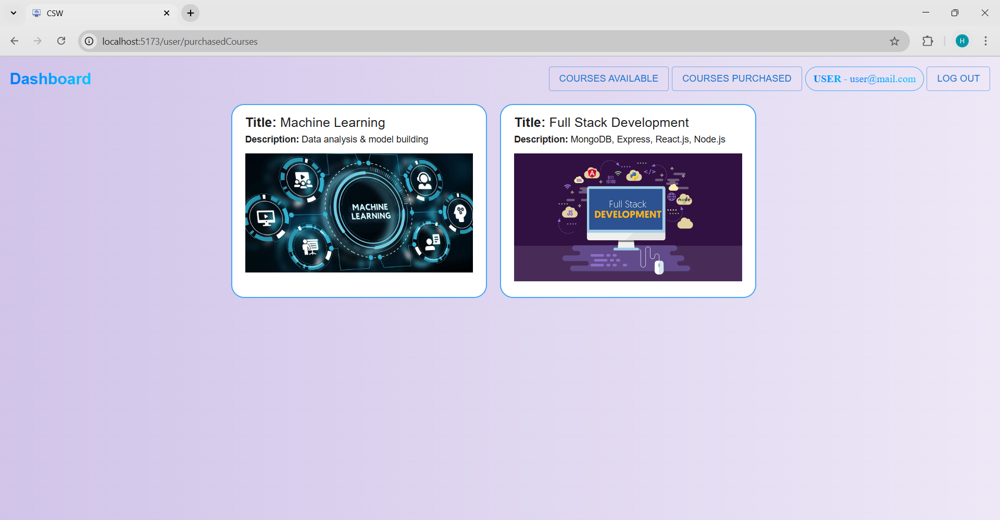
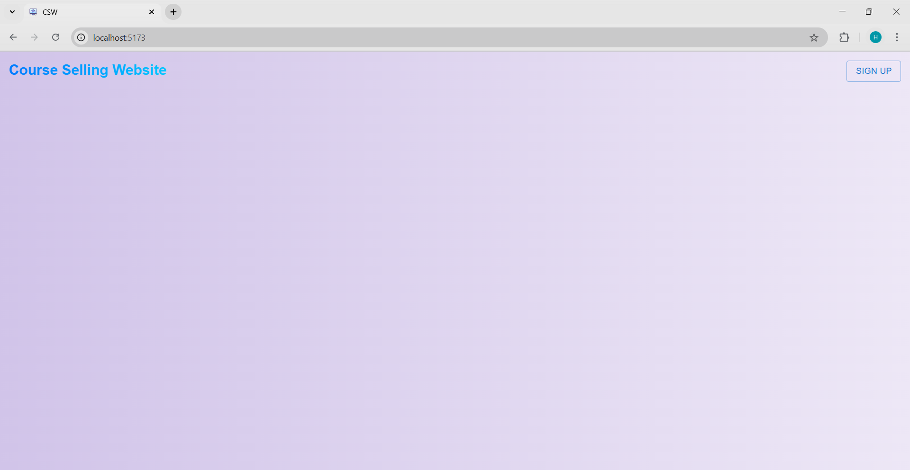

# Course Selling Website -

## Objective:
This project is a full-stack course selling platform where users can browse and purchase courses, while admins can manage the course catalog. It is built using the **MERN (MongoDB, Express, React.js, Node.js) stack**.

## Tech Stack:
- **Frontend:** React.js
- **Backend:** Node.js, Express.js
- **Database:** MongoDB Compass
- **Authentication:** JWT & bcrypt (for hashed passwords)

## Features:
### Admin:
- Signup/Login with authentication.
- Add new course.
- View all available courses.
- Update course details.
- Delete a course.

### User:
- Signup/Login with authentication.
- Browse available courses.
- Purchase courses and view them.

## Project Structure:
```
Course-Selling-Website/
│── server(backend)/
│   ├── db/             # Database models
│   ├── admin_routes/   # Express routes (admin)
│   ├── user_routes/    # Express routes (user)
│   ├── middleware/     # Authentication & validation
│   ├── index.js        # Entry point for backend
│
│── src(frontend)/
│   ├── AdminAddCourse.jsx/         # Add course component for admin
│   ├── AdminCourse.jsx/            # Edit course component for admin
│   ├── AdminCourses.jsx/           # View all courses component for admin
│   ├── Appbar.jsx/                 # Top app bar component
│   ├── Signup.jsx/                 # Signip/login component
│   ├── UserCourses.jsx/            # View all courses component for user
│   ├── UserPurchasedCourses.jsx/   # Purchase courses and view them component for user
│   ├── App.jsx                     # Main app component
│   ├── main.jsx                    # Entry point for frontend
│
│── README.md
│── package.json (Frontend & Backend dependencies)
```

## Installation & Usage:
### 1) Clone the repository:
```sh
git clone https://github.com/Ca853-V1/Course-Hive.git
cd course-selling-website
npm install  # Install dependencies
```

### 2) Backend Setup:
```sh
cd course-selling-website/server
node index.js  # Start backend server
```

### 3) Frontend Setup:
```sh
cd course-selling-website
npm run dev  # Start frontend development server on separate terminal
```

### 4) Environment Variables:
- Change mongoDB cluster and port number as per your requirement in the index.js file inside server.
- Change the secret key for authentication inside the middleware folder inside the server.
```

## Future Scope:
- Add payment gateway to purchase courses.
- Introduce video streaming for courses or to interact between user and admin.

---








